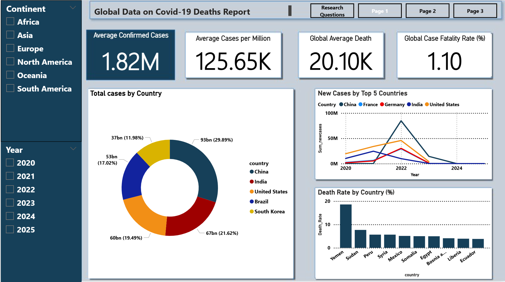

# COVID-19 Deaths Data Analysis Dashboard (Power BI)

## Project Overview
This project presents a comprehensive analysis of global COVID-19 deaths data using Power BI.  
It focuses on understanding COVID-19 case trends, death rates, and their relationship with population demographics and country-level indicators.

The analysis is based on a cleaned and refined dataset derived from a larger COVID-19 dataset that originally contained over 60 variables. Due to high levels of missing data (over 70% null values) in several fields, only reliable and consistent variables were retained to ensure meaningful insights.

> **Dataset download date:** 21 July 2025

---

## Objectives
- Analyze total and new COVID-19 cases across countries
- Examine COVID-19 death rates and fatalities per million
- Compare trends across continents
- Study demographic factors influencing death rates
- Visualize global COVID-19 trends over time

---

## Tools & Technologies
- Power BI Desktop
- CSV Dataset
- Star Schema Data Modeling
- GitHub

---

## Dataset Description
The cleaned dataset contains **21 key fields**, grouped into the following categories:

### Epidemiological Metrics
- Total cases
- New cases
- Smoothed cases
- Total deaths
- New deaths
- Smoothed deaths
- Per-million case and death indicators

### Geographic Indicators
- Country
- Continent
- ISO country code

### Demographic & Socioeconomic Indicators
- Population
- Population density
- Median age
- GDP per capita
- Diabetes prevalence

### Date Dimension
- Date (used for trend and time-series analysis)

Fields related to vaccinations, hospital capacity, testing rates, boosters, and policy indices were removed due to excessive missing values.

---

## Data Model (Star Schema)
The dataset was modeled using a **star schema** to improve performance and analytical flexibility in Power BI:

- **Fact Table – Fact_CovidCases**
  - Daily COVID-19 cases, deaths, and per-million metrics per country

- **Dim_Date**
  - Day, month, and year breakdown for time-series analysis

- **Dim_Country**
  - Country name, ISO code, and continent

- **Dim_Demographics**
  - Population, population density, median age, GDP per capita, diabetes prevalence

This structure avoids data duplication and supports efficient filtering and aggregation.

---

## Key Research Questions Answered
1. Top 5 countries by total COVID-19 cases
2. Top 5 countries by new daily cases
3. Top 10 countries by case fatality rate
4. Variation of cases per million across continents
5. Global trend of new cases over time
6. Death rate trends over time for the top 5 countries
7. Top 10 countries by deaths per million
8. Smoothed trend of new deaths per million over time
9. Average median age of countries with highest death rates (Top 10)
10. Smoothed trends of new cases per million by continent

---

## Dashboard Features
- Interactive filters and slicers
- Country and continent comparisons
- Time-series trend analysis
- Demographic impact visualization
- Smoothed metrics to reduce reporting noise

---

## Project Structure
- Timilehin_Onasanya.pbix/ – Power BI dashboard file
- Covid19_deaths-Report/ – COVID-19 analysis report (PDF/DOCX)
- images/ – Dashboard screenshots

---

## How to Use
1. Download the `.pbix` file from the `pbix` folder
2. Open it using **Power BI Desktop**
3. Refresh the dataset if needed
4. Use slicers to explore trends by country, continent, and time

---

## Dashboard Preview

---

## Conclusion
This project demonstrates how a refined COVID-19 dataset, combined with a star schema data model and Power BI visualizations, can provide meaningful insights into pandemic trends, mortality patterns, and demographic impacts.

By prioritizing data completeness and interpretability, the dashboard supports public health analysis, policy evaluation, and further academic research.

---

## Author
**Timilehin Onasanya**  
